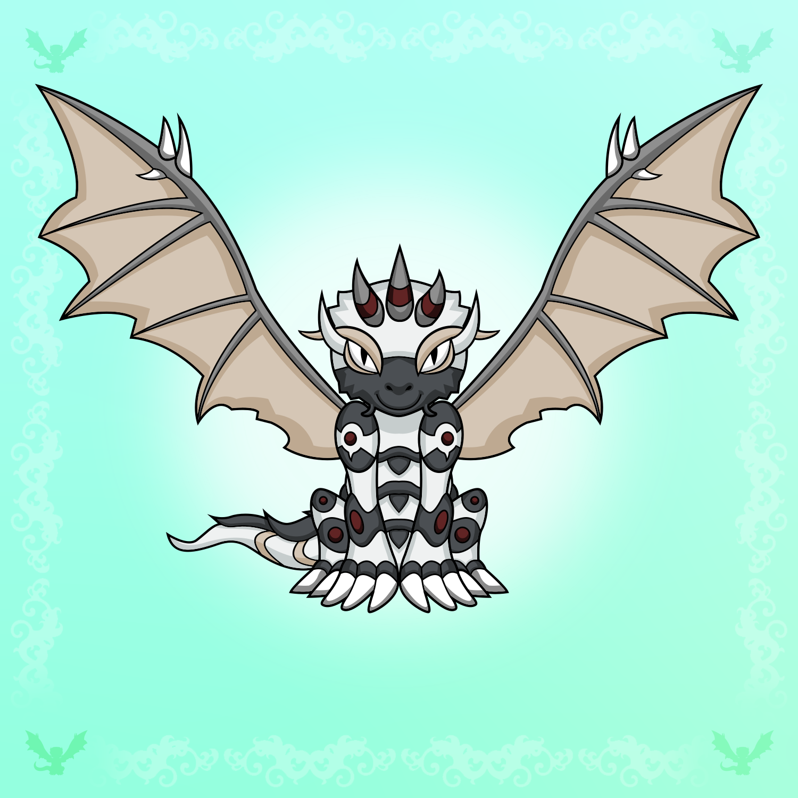

# Cruna Core Protocol

## The protocol

The Cruna Core Protocol establishes a unique hierarchy between an NFT and one or more applications, so that the owner of the NFT is also the owner of the correspondent profile of the application.

While the owning token functions as a conventional NFT, complete with rarity distribution and other standard attributes, the owned app focuses on providing tangible utility. In the Cruna MVP, the inaugural application takes the form of a Transparent Vault.

### The protector

Since the owning token carries significant responsibility, we suggest that implementers add extra-security to the ERC721 standard. In this repo, you can extend the ProtectedERC721 contract to create a Protected NFT, i.e., an NFT that can disable approvals and can set a protector wallet that must initialize relevant transactions (like transfers).

To enhance security, certain limitations have been implemented.

**Interaction with Marketplaces:**

- The NFT cannot be approved for everyone, as this is a common avenue for phishing attacks.
- Before using the protected NFT (for example, before depositing in a vault), the NFT should be made not-approvable. The Cruna dashboard will push the user to do so.

**Ownership Transfer:**

- While a Protected NFT can be transferred by default, the owner has the option to designate an initiator wallet.
- When an protector is assigned, any transfer process must be initiated by the protector and subsequently confirmed by the owner. This added layer of security ensures that even in the event of phishing, scammers cannot transfer the NFT without the protector's involvement. And, in case the protector is scammed, still the owner must confirm the transfer.

### The Transparent Vault

A Transparent Vault is a an application designed to store and safeguard assets (ERC20, ERC721, ERC1155). Its ownership is derived from the owning NFT, meaning that transferring the NFT's ownership will also transfer the ownership of the Transparent Vault.

The Transparent Vault inherits security features from its owning NFT if the owning NFT is a ProtectedERC721. If the NFT's owner has designated a protector, any movement within the Transparent Vault must be initiated by the protector and confirmed by the owner. This added security layer helps prevent scammers from transferring or withdrawing assets in the event of phishing. Typically, a protector is a wallet stored in a cold wallet, reserved for crucial operations and not used for daily transactions.

Assets can be deposited into the Transparent Vault by the NFT's owner or other wallets. To prevent abuse, the owner can establish rules to permit deposits from everyone, specific wallets, or exclusively from the owner. It's also possible to implement a confirmation-based system requiring the owner's approval for deposits not originating from whitelisted wallets or the owner themselves.

Asset transfers between Protectors can be executed by the owner, even if an initiator is set, as long as the destination NFT is owned by the same wallet. If the destination NFT has a different owner, the initiator must be utilized.

The simple concept of a Transparent Vault dramatically enhances the security of an NFT collection.

### Use Cases

- Consolidate all assets of a collection into a single Transparent Vault, allowing a seamless transfer of ownership without needing to move each asset individually. This offers significant improvements in security and user experience.

- Create asset bundles and list them for sale as a single NFT on popular marketplaces like OpenSea.

- Deposit vested assets into a Transparent Vault for scheduled distribution to investors, team members, etc. Note that for this to work, the asset must be capable of managing the vesting schedule. In a future version of the Cruna Core Protocol, a Transparent Distributor will be introduced to handle the vesting of any assets.

### Contract ownership

The Cruna Core Protocol lays the foundation for any NFT collection to incorporate a Transparent Vault. CoolProject has the distinction of being the inaugural project to execute this protocol.

Given that any project utilizing the protocol could theoretically introduce harmful functions, the Cruna DAO will conduct audits on the associated contracts. Following this review, they will then determine whether the project should be granted access to be managed within the Cruna dashboard. Projects that have not been listed and choose to implement the protocol are required to construct their own management dashboard.

### Costs

Implementing the Cruna Core Protocol necessitates a sophisticated UI to manage both NFTs and applications. Cruna will develop this UI, which will be freely accessible to all projects looking to integrate the Cruna Core Protocol that will successfully pass Cruna's audit. To offset costs, a royalty fee may be applied to the initial sale of each NFT. Alternatively, projects may choose to pay a one-time fee to Cruna to remove the royalty. The Cruna DAO will determine the royalty fee and one-time fee based on the project's size and scope.

## Other included contracts

This repo contains other contracts used as a foundation for the Cruna Core Protocol.

# Simple Soulbound ERC721

A simple model for soulbound tokens and badges.

## The interfaces

### IERC721DefaultApprovable

```solidity
// SPDX-License-Identifier: GPL3
pragma solidity ^0.8.17;

// Author: Francesco Sullo <francesco@sullo.co>

// erc165 interfaceId 0xbfdf8f79
interface IERC721DefaultApprovable {
  // Must be emitted when the contract is deployed.
  event DefaultApprovable(bool approvable);

  // Must be emitted any time the status changes.
  event Approvable(uint256 indexed tokenId, bool approvable);

  // Returns true if the token is approvable.
  // It should revert if the token does not exist.
  function approvable(uint256 tokenId) external view returns (bool);

  // A contract implementing this interface should not allow
  // the approval for all. So, any actor validating this interface
  // should assume that the tokens are not approvable for all.

  // An extension of this interface may include info about the
  // approval for all, but it should be considered as a separate
  // feature, not as a replacement of this interface.
}
```

### IERC6982

```solidity
// SPDX-License-Identifier: CC0-1.0
pragma solidity ^0.8.0;

// erc165 interfaceId 0x6b61a747
interface IERC6982 {
  // Must be emitted one time, when the contract is deployed,
  // defining the default status of any token that will be minted
  event DefaultLocked(bool locked);

  // Must be emitted any time the status changes
  event Locked(uint256 indexed tokenId, bool locked);

  // Returns the status of the token.
  // If no special event occurred, it must return the default status.
  // It should revert if the token does not exist.
  function locked(uint256 tokenId) external view returns (bool);
}
```

## How to use it

Install the dependencies like

```
npm i @cruna/protocol
```

and use as

```solidity
// SPDX-License-Identifier: GPL3
pragma solidity ^0.8.19;

import "@cruna/protocol/soulbound/Soulbound.sol";

contract MySoulbound is Soulbound {
  constructor() Soulbound("My Soulbound Token", "MST") {
    emit DefaultApprovable(false);
    emit DefaultLocked(true);
  }
}
```

# Dominant-Subordinate Protocol

### This was previously in @ndujaLabs/ERC721Subordinate

A protocol to subordinate ERC721 contracts to a dominant contract so that the subordinate follows the ownership of the dominant, which can be even be an ERC721 contract that does not have any additional features.

## Why

In 2021, when we started CoolProject, we had in mind of using the head of the dragons for a PFP token based on the CoolProject that you own. Here an example of a full dragon and just the head.




The question was, _Should we allow people to transfer the PFP separately from the primary NFT?_ It didn't make much sense. At the same time, how to avoid that?

ERC721Subordinate introduces a subordinate token that are owned by whoever owns the dominant token. In consequence of this, the subordinate token cannot be approved or transferred separately from the dominant token. It is transferred when the dominant token is transferred.

## The interfaces

```solidity
// A subordinate token can be associated to any ERC721 token.
// However, it it is necessary that the subordinate token is visible on services
// like marketplaces, the dominant token must propagate any Transfer event to the subordinate

// ERC165 interface id is 0x48b041fd
interface IERC721Dominant {
  function subordinateByIndex(uint256 index) external view returns (address);

  function isSubordinate(address subordinate_) external view returns (bool);

  function countSubordinates() external view returns (uint256);
}
```

```solidity
// A subordinate contract has no control on its own ownership.
// Whoever owns the main token owns the subordinate token.
// ERC165 interface id is 0x431694c0
interface IERC721Subordinate {
  // The function dominantToken() returns the address of the dominant token.
  function dominantToken() external view returns (address);

  // Most marketplaces do not see tokens that have not emitted an initial
  // transfer from address 0. This function allow to fix the issue, but
  // it is not mandatory — in same cases, the deployer may want the subordinate
  // being not visible on marketplaces.
  function emitTransfer(address from, address to, uint256 tokenId) external;
}
```

To avoid loops, it is paramount that the subordinate token sets the dominant token during the deployment and is not be able to change it.

## How to use it

Install the dependencies like

```
npm i @cruna/protocol
```

## How it works

You initialize the subordinate token passing the address of the main token and the subordinate takes anything from that. Look at some example in mocks and the testing.

What makes the difference is the base token uri. Change that, and everything will work great.

A simple example:

```solidity
// SPDX-License-Identifier: GPL3
pragma solidity 0.8.17;

import "@cruna/protocol/dominant-subordinate/ERC721Subordinate.sol";

contract MySubordinate is ERC721Subordinate {
  constructor(address myToken) ERC721Subordinate("MyToken", "MTK", myToken) {}
}
```

Another example, upgradeable

```solidity
// SPDX-License-Identifier: GPL3
pragma solidity ^0.8.9;

import "@openzeppelin/contracts-upgradeable/proxy/utils/UUPSUpgradeable.sol";
import "@cruna/protocol/dominant-subordinate/ERC721SubordinateUpgradeable.sol";

contract MySubordinateUpgradeable is ERC721SubordinateUpgradeable, UUPSUpgradeable {
  /// @custom:oz-upgrades-unsafe-allow constructor
  constructor() initializer {}

  function initialize(address myTokenEnumerableUpgradeable) public initializer {
    __ERC721EnumerableSubordinate_init("SuperToken", "SPT", myTokenEnumerableUpgradeable);
  }

  function _authorizeUpgrade(address newImplementation) internal virtual override {}

  function getInterfaceId() public pure returns (bytes4) {
    return type(IERC721SubordinateUpgradeable).interfaceId;
  }
}
```

Notice that there is no reason to make the subordinate enumerable because we can query the dominant token to get all the ID owned by someone and apply that to the subordinate.

## Similar proposal

There are similar proposal that moves in the same realm.

[EIP-6150: Hierarchical NFTs](https://github.com/ethereum/EIPs/blob/ad986045e87d1e659bf36541df6fc13315c59bd7/EIPS/eip-6150.md) (discussion at https://ethereum-magicians.org/t/eip-6150-hierarchical-nfts-an-extension-to-erc-721/12173) is a proposal for a new standard for non-fungible tokens (NFTs) on the Ethereum blockchain that would allow NFTs to have a hierarchical structure, similar to a filesystem. This would allow for the creation of complex structures, such as NFTs that contain other NFTs, or NFTs that represent collections of other NFTs. The proposal is currently in the discussion phase, and has not yet been implemented on the Ethereum network. ERC721Subordinate focuses instead on a simpler scenario, trying to solve a specific problem in the simplest possible way.

EIP-3652 (https://ethereum-magicians.org/t/eip-3652-hierarchical-nft/6963) is very similar to EIP-6150. Both requires all the node following the standard. ERC721Subordinate is very different because it allows to create subordinates of existing, immutable NFTs, if it is not necessary to show the subordinate on marketplaces.

## Implementations

[CoolProjectPFP](https://github.com/ndujaLabs/everdragons2-core/blob/VP/contracts/CoolProjectPFP.sol)

Feel free to make a PR to add your contracts.

## History

For initial history changes, look at [the history in the previous repo](https://github.com/cruna-cc/ds-protocol#history)

# NFT-owned Smart Contracts

## Overview

The NFTOwned protocol (extended by the TransparentSafeBox) allows an NFT (owning token) to have control over a subordinate contract implementing the INFTOwned interface. The owning token is an ERC721 token, and the subordinate contract is designed to restrict certain actions to the owner of the owning token.

There are many attempts to allow NFTs to own smart contracts, wallets, etc. For example, the clever [ERC6551](https://eips.ethereum.org/EIPS/eip-6551) and the minimalistic [ERC3652](https://github.com/ethereum/EIPs/pull/3652) (closed due to inactivity). Both require the deploy of a new contract for any tokenId. ERC6551 also restrict the tokenId to a single owned wallet.

NFTOwned, instead, does not put any limit on the number of subordinate contracts and allows the deployment of a single smart contract bound to the NFT, which inherits the owners of the NFT.

## The interface

```solidity
// SPDX-License-Identifier: GPL3
pragma solidity ^0.8.19;

// An owned contract has no control on its own ownership.
// Whoever owns the owning token owns the owned contract.
// ERC165 interface id is 0x920c8b9e

/* is ERC165 */
interface INFTOwned {
  // Must be throw if the owning token is not an NFT
  error OwningTokenNotAnNFT();

  // Must be emitted a single time, at deployment.
  // If emitted more than one time, the contract should be
  // considered compromised and not used.
  event OwningTokenSet(address owningToken);

  // Returns the address of the owning token.
  function owningToken() external view returns (address);

  // Returns the address of the owner of a specific tokenId of the owning token.
  // Notice that this protocol makes sense only for contract that implements
  // some logic using an id corresponding to a tokenId of the owning token.
  function ownerOf(uint256 tokenId) external view returns (address);
}
```

The smart contract implementing the interface should verify that the owning token is an ERC-721. However, the protocol can be used to extend any smart contract that exposes an ownerOf function.

## The implementation

This repository contains the following Solidity smart contracts:

**INFTOwned.sol**: The interface for the subordinate contract.

**NFTOwned.sol**: The implementation of the INFTOwned interface, extending the ERC165 interface for supporting standard interfaces.

Plus examples to show how to use it:

**MyOwnedContract.sol**: A sample subordinate contract that extends NFTOwned. It contains a mapping of token IDs to amounts and provides methods to initialize the contract and add amounts.

**MyToken.sol**: An ERC721 contract that acts as the owning token in the protocol.

## Use Cases

The NFTOwned protocol can be used in scenarios where an ERC721 token (NFT) is required to control a related contract. Examples include:

- Controlling access to certain functions in a smart contract based on the ownership of an NFT.
- Implementing a rewards system where the owning token (NFT) controls the distribution of rewards to its owner.

## How It Works

The MyOwnedContract contract is a sample subordinate contract that extends the NFTOwned contract. It has the following functionalities:

Initialize the contract by calling the init function. This function can only be called by the owner of the corresponding owning token (NFT).

Add some amount to the contract by calling the addSomeAmount function. This function can only be called by the owner of the corresponding owning token (NFT).

The MyToken contract is an ERC721 token that acts as the owning token in this protocol. The owner of this token has control over the MyOwnedContract instances that correspond to the owned tokens.

## Usage

### THE NPM PACKAGE HAS NOT BEEN PUBLISHED YET

```bash
npm i @cruna/protocol
```

A simple subordinate contract:

```solidity
// SPDX-License-Identifier: GPL3
pragma solidity ^0.8.9;

import "@cruna/protocol/nft-owned/NFTOwned.sol";

contract MyOwnedContract is NFTOwned {
  error Unauthorized();

  // here your variables

  modifier onlyOwnerOf(uint256 tokenId) {
    if (msg.sender != ownerOf(tokenId)) revert Unauthorized();
    _;
  }

  constructor(address owningToken_) NFTOwned(owningToken_) {}

  // here your specific functions
}
```

## History

**1.0.3**

- removes some unused variables from TransparentSafeBox
- modifies TransparentSafeBox so that TransparentVaultEnumerable can extend it
- checks at initialization time if the owning token is a ProtectedERC721 and saves it in a variable

**1.0.2**

- move the vault from extending ERC721Subordinate to NFTOwned
- rename the Protector as ERC721Protected
- **1.0.1**

- improve publish script

**1.0.0-beta.7**

- Putting in this repo, code previously in @cruna/ds-protocol.

**1.0.0-beta.4**

- Make the protector approvable by default. The owner will be pushed to make it not-approvable when depositing the first asset in the Transparent Vault.

**1.0.0-beta.3**

- Remove post-install, creating issues when loaded as a dependency

**1.0.0-beta.2**

- Adding \_\_gap variables to Transparent Vault contracts to allow for future upgrades

**1.0.0-beta.1**

- ready to publish it as an npm package

**0.1.5**

- Moving to use @cruna/ds-protocol instead of @ndujalabs/erc721subordinate
- Adding batch minting functions

**0.1.4**

- Optimize mappings using keccak256

**0.1.3**

- Renaming the protocol
- Separating the implementations in the `protected` folder

**0.1.2**

- Add a starter, i.e., a second wallet that must start the transfer of the protector NFT
- If a starter is active, the protected will only allow transfers of assets between protectors not owned by the same owner only if the transfer is started by the starter

**0.1.1**

- Separate ERC721Attributable from IProtector interface for clarity and generality

**0.1.0**

- first version

## Contributions

This project has born from the collaboration between [CoolProject](https://everdragons2.com), [Nduja Labs](https://ndujalabs.com) and [The Round Table](https://trt.gg).

## License

Copyright (C) 2023 Cruna

This program is free software: you can redistribute it and/or modify
it under the terms of the GNU General Public License as published by
the Free Software Foundation, either version 3 of the License, or
(at your option) any later version.

This program is distributed in the hope that it will be useful,
but WITHOUT ANY WARRANTY; without even the implied warranty of
MERCHANTABILITY or FITNESS FOR A PARTICULAR PURPOSE. See the
GNU General Public License for more details.

You may have received a copy of the GNU General Public License
along with this program. If not,
see <https://www.gnu.org/licenses/gpl-3.0.en.html>.
